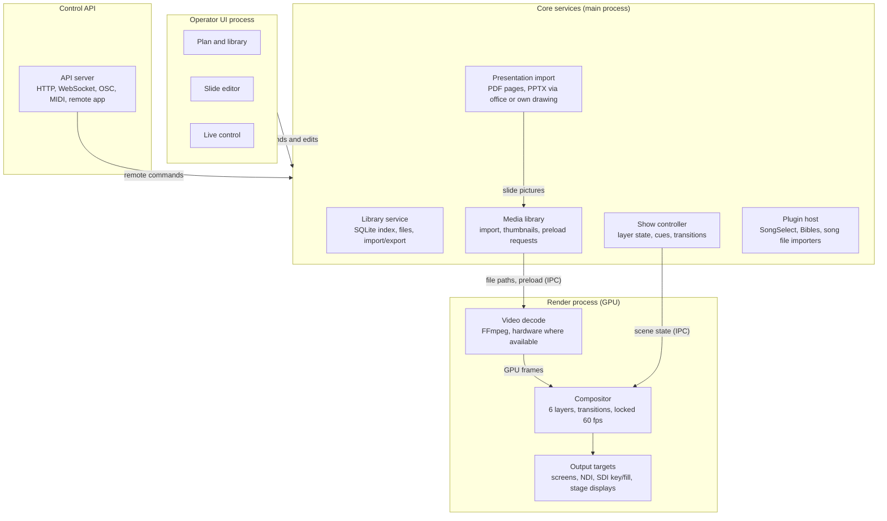
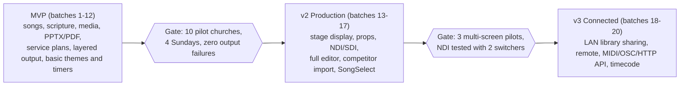

# Diagrams

## System architecture

The renderer runs apart from the UI, so a UI crash never freezes the screen.

```mermaid
flowchart TB
  subgraph UI["Operator UI process"]
    PL["Plan and library"]
    SE["Slide editor"]
    LC["Live control"]
  end
  subgraph CORE["Core services (main process)"]
    LIB["Library service<br/>SQLite index, files, import/export"]
    MED["Media library<br/>import, thumbnails, preload requests"]
    DECK["Presentation import<br/>PDF pages, PPTX via office or own drawing"]
    SHOW["Show controller<br/>layer state, cues, transitions"]
    PLG["Plugin host<br/>SongSelect, Bibles, song file importers"]
  end
  subgraph API["Control API"]
    APIS["API server<br/>HTTP, WebSocket, OSC, MIDI, remote app"]
  end
  subgraph RENDER["Render process (GPU)"]
    DEC["Video decode<br/>FFmpeg, hardware where available"]
    COMP["Compositor<br/>6 layers, transitions, locked 60 fps"]
    OUT["Output targets<br/>screens, NDI, SDI key/fill, stage displays"]
  end
  UI -- "commands and edits" --> CORE
  APIS -- "remote commands" --> CORE
  MED -- "file paths, preload (IPC)" --> DEC
  DECK -- "slide pictures" --> MED
  DEC -- "GPU frames" --> COMP
  SHOW -- "scene state (IPC)" --> COMP
  COMP --> OUT
```

## Roadmap

```mermaid
flowchart LR
  MVP["MVP (batches 1-12)<br/>songs, scripture, media, PPTX/PDF,<br/>service plans, layered output, basic themes and timers"]
  G1{{"Gate: 10 pilot churches,<br/>4 Sundays, zero output failures"}}
  V2["v2 Production (batches 13-17)<br/>stage display, props, NDI/SDI,<br/>full editor, competitor import, SongSelect"]
  G2{{"Gate: 3 multi-screen pilots,<br/>NDI tested with 2 switchers"}}
  V3["v3 Connected (batches 18-20)<br/>LAN library sharing, remote, MIDI/OSC/HTTP API, timecode"]
  MVP --> G1 --> V2 --> G2 --> V3
```
